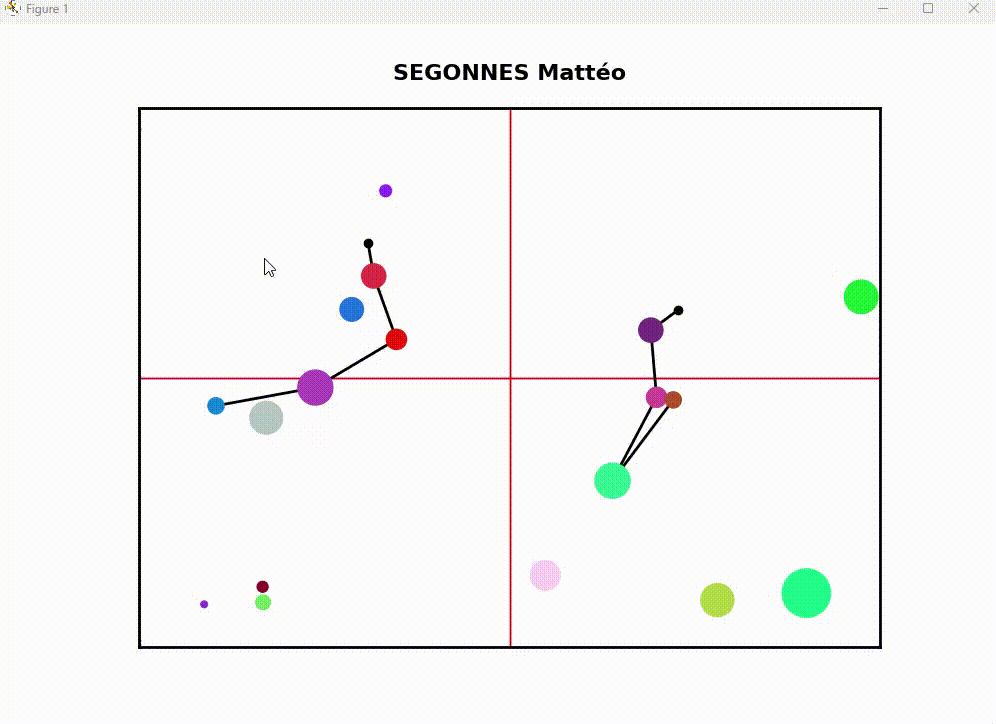
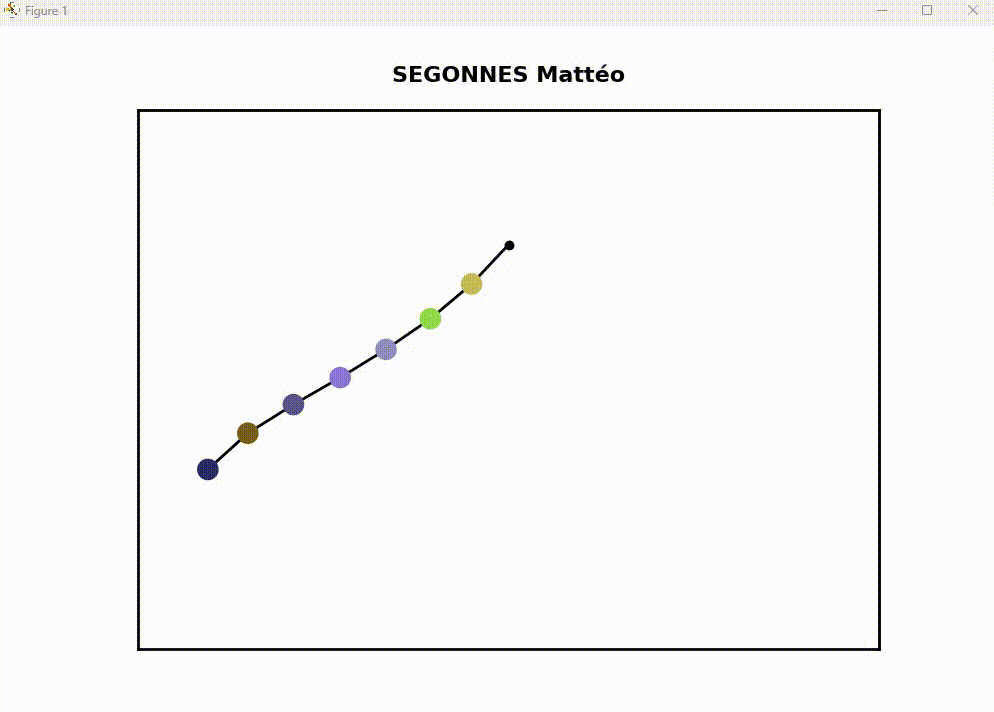
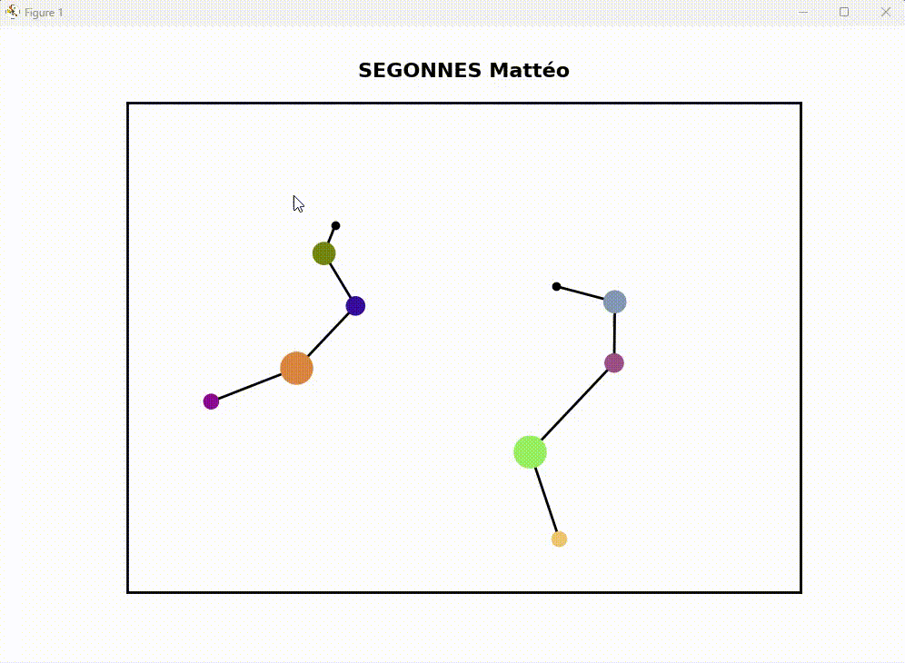
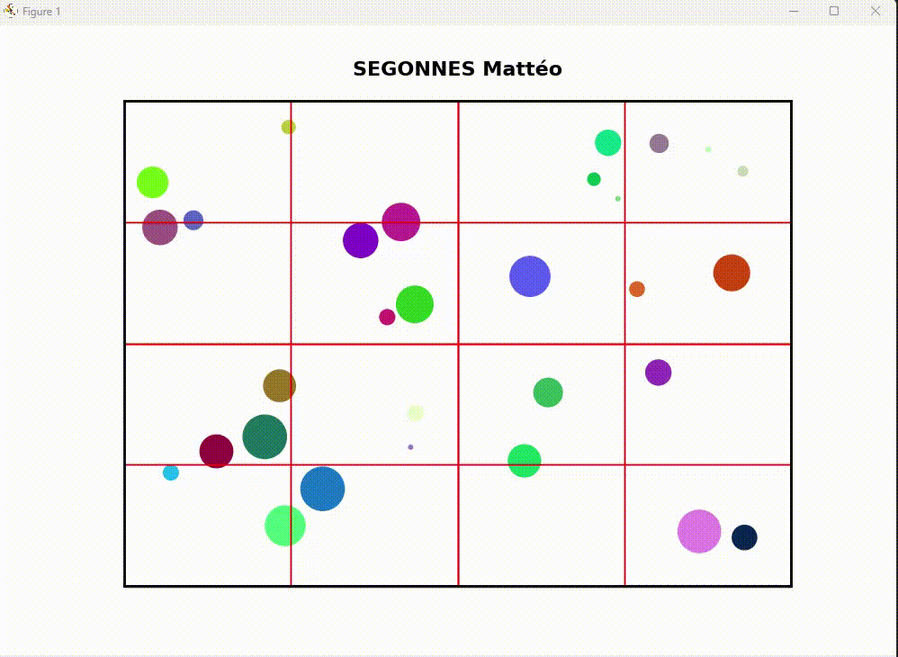

# Multi-Pendulum-Dynamics-and-Collision-Simulation

This simulation particularly emphasizes the interactions between the pendulum bobs and external spherical objects.

## Dynamics Equation
The dynamics of the pendulum system are governed by the following equation:

```math
\sum_{k=q}^{n} \left( g m_k l_q \sin(\theta_q) + m_k \sum_{i=1}^{k} l_i l_q \dot{\theta}_i \dot{\theta}_q \sin(\theta_q - \theta_i) + m_k l_q^2 \ddot{\theta}_q  + m_k \sum_{i=1}^{k} l_i l_q \dot{\theta}_i \dot{\theta}_q \sin(\theta_i - \theta_q) \left[\dot{\theta}_q - \dot{\theta}_i\right] + m_k \sum_{i=1}^{k} l_i l_q \psi_{iq} \cos(\theta_i - \theta_k) \ddot{\theta}_i\right) = 0

```
I used Runge-Kutta method to solve this, RK4 method.

## Simulation Visualizations

### Pendulum Collisions


### Pendulum Motion





### Quadtree Collision Efficiency


